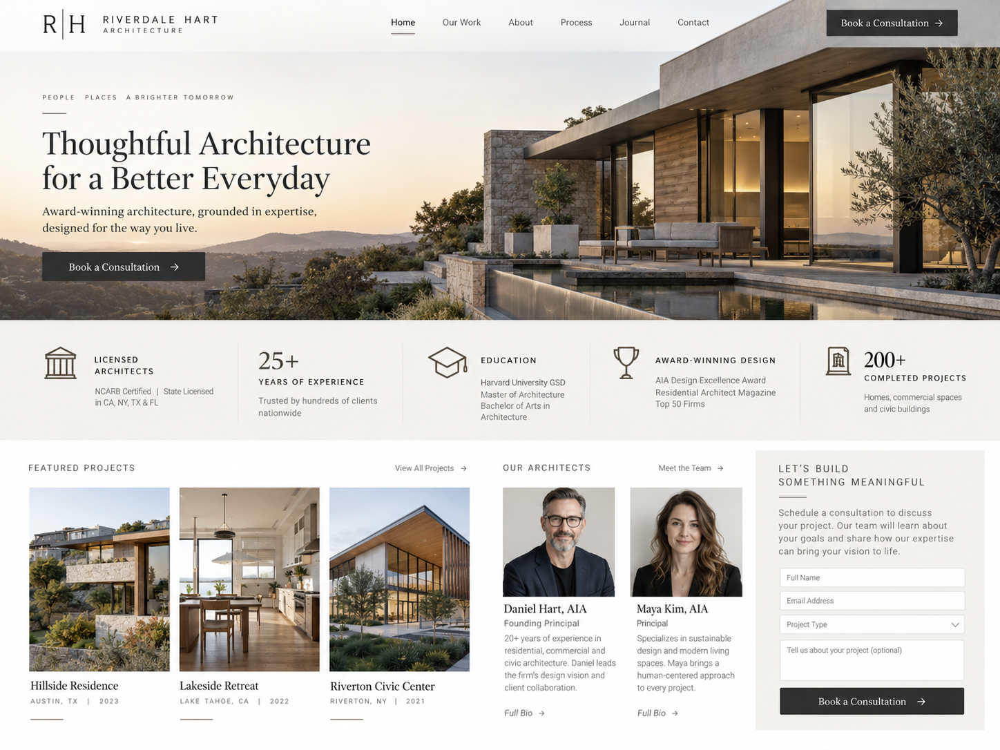

# Authority

## What It Is

Authority is Robert Cialdini's principle that people are more likely to trust and follow guidance from people or organizations they view as knowledgeable, experienced, or credible.

In branding and website design, authority can be communicated by showing legitimate qualifications, expertise, professional experience, awards, certifications, or other evidence that supports a person's or organization's credibility.

## When to Use It

Authority can be useful when visitors need confidence that the person or organization providing information is qualified or trustworthy.

It can be especially useful for:

- professional services
- healthcare and education websites
- consulting businesses
- financial services
- technical products
- organizations providing expert advice

Authority should be based on real qualifications and experience.

## How to Apply It

A website can communicate authority by displaying:

- professional credentials
- certifications
- relevant education
- years of experience
- completed projects
- awards or recognition
- expert biographies
- verified professional affiliations

These elements should be placed near important decisions, such as booking a consultation, purchasing a service, or requesting professional advice.

## Website Design Example

Imagine an architecture firm's website.

Near the consultation form, the website displays information about the architects working at the firm, including their professional licenses, education, years of experience, and examples of completed projects.

A visitor considering hiring the firm can see evidence that the architects have relevant knowledge and experience.

This demonstrates Authority because the website uses legitimate credentials and professional experience to establish credibility before asking the visitor to schedule a consultation.

## Visual Example

## Ethical Use

Authority should not be used by exaggerating or inventing qualifications.

A responsible use of Authority:

- displays real credentials
- accurately describes professional experience
- avoids fake awards or certifications
- clearly identifies the source of expertise
- does not imply qualifications that a person or organization does not have

The goal should be to help visitors evaluate credibility using accurate information.

## Sources

- [Robert Cialdini's Seven Principles of Persuasion — Influence at Work](https://www.influenceatwork.com/7-principles-of-persuasion/)

## Navigation

[← Back to Principles of Persuasion](../Methods%20of%20Persuasion.md)