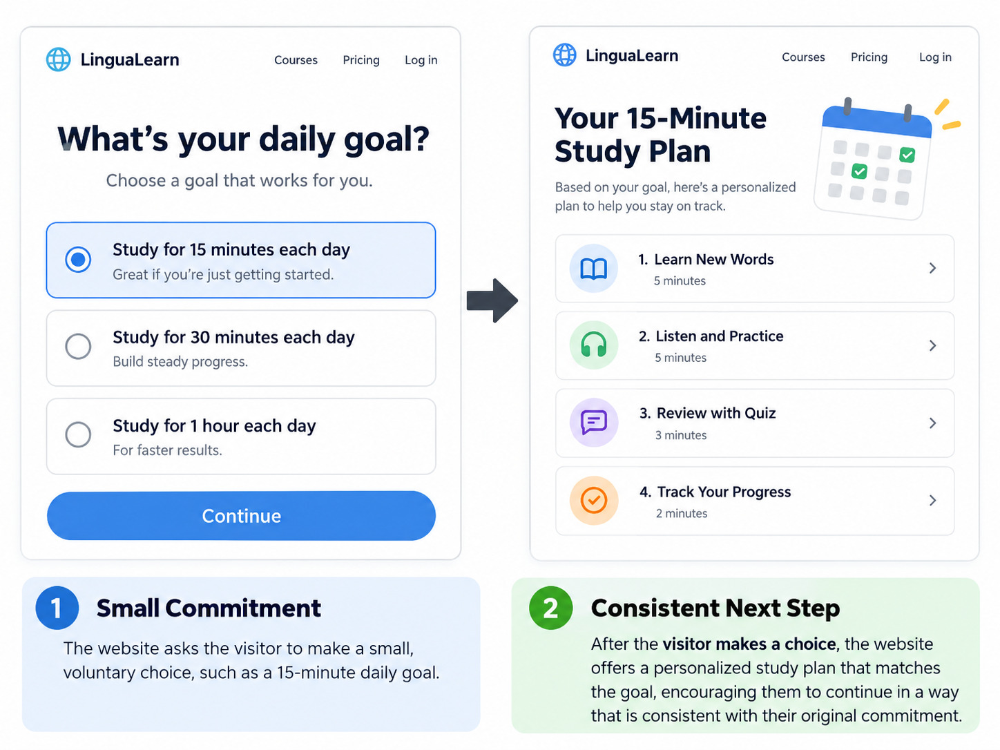

# Commitment and Consistency

## What It Is

Commitment and Consistency is Robert Cialdini's principle that people tend to act in ways that are consistent with choices or commitments they have already made.

In branding and website design, this can be used by encouraging users to make a small, voluntary choice first and then offering a next step that matches that choice.

## When to Use It

Commitment and Consistency can be useful when a website wants to help users build progress over time.

It can work well for:

- learning platforms
- fitness apps
- budgeting tools
- productivity websites
- subscription services
- goal-setting platforms

The first commitment should be small, clear, and voluntary.

## How to Apply It

A website can use Commitment and Consistency by asking users to:

- choose a goal
- select a preference
- create a simple plan
- save progress
- complete a small first step
- set a reminder or schedule

The next action should logically support the choice the user already made.

## Website Design Example

Imagine a language-learning website.

The website first asks a visitor to choose a daily goal, such as:

**Study for 15 minutes each day**

After the visitor selects the goal, the website offers a personalized practice schedule that matches that commitment.

This demonstrates Commitment and Consistency because the website encourages the user to continue acting in a way that matches the goal they already chose.

## Visual Example

## Ethical Use

Commitment and Consistency should not be used to trap users into unwanted decisions.

A responsible use of this principle:

- makes the first commitment voluntary
- clearly explains what the user is choosing
- allows users to change their mind
- avoids hidden subscriptions or obligations
- supports the user's own goals

The purpose should be to help users follow through on choices they genuinely want to make.

## Sources

- [Robert Cialdini's Seven Principles of Persuasion — Influence at Work](https://www.influenceatwork.com/7-principles-of-persuasion/)

## Navigation

[← Back to Principles of Persuasion](../Methods%20of%20Persuasion.md)