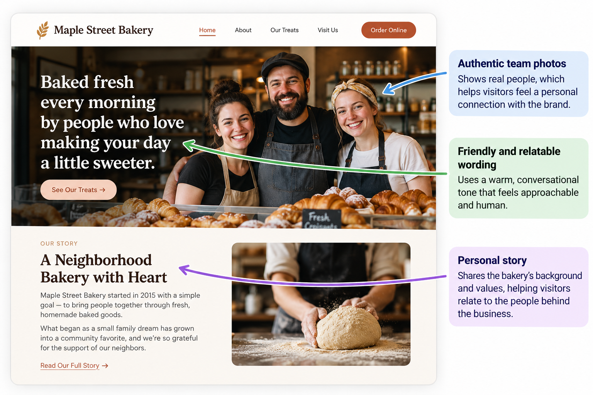

# Liking

## What It Is

Liking is Robert Cialdini's principle that people are more likely to respond positively to people or brands they like, relate to, or feel connected with.

In branding and website design, liking can be supported by using a friendly tone, relatable stories, authentic images, and shared interests.

## When to Use It

Liking can be useful when a website wants to build a more personal connection with visitors.

It works well for:

- small businesses
- personal brands
- local businesses
- service providers
- community organizations
- lifestyle brands

The goal should be to make the brand feel human and relatable.

## How to Apply It

A website can use Liking by including:

- friendly and conversational wording
- authentic staff or founder photos
- personal stories
- shared interests or values
- approachable design
- testimonials that feel genuine
- community-focused content

The website should feel welcoming without pretending to be something it is not.

## Website Design Example

Imagine a neighborhood bakery website.

The homepage includes photos of the staff, a short story about how the bakery started, and friendly wording such as:

**Baked fresh every morning by people who love making your day a little sweeter.**

The page also includes photos of the team serving customers and preparing baked goods.

This demonstrates Liking because the website helps visitors connect with the people behind the business.

## Visual Example

## Ethical Use

Liking should not be used by pretending to share values or interests that are not genuine.

A responsible use of Liking:

- uses authentic stories
- represents real people accurately
- avoids fake testimonials
- does not manipulate users with false emotional connections
- keeps the brand's personality honest and consistent

The goal should be to create a genuine connection with visitors.

## Sources

- [Robert Cialdini's Seven Principles of Persuasion — Influence at Work](https://www.influenceatwork.com/7-principles-of-persuasion/)

## Navigation

[← Back to Principles of Persuasion](../Methods%20of%20Persuasion.md)