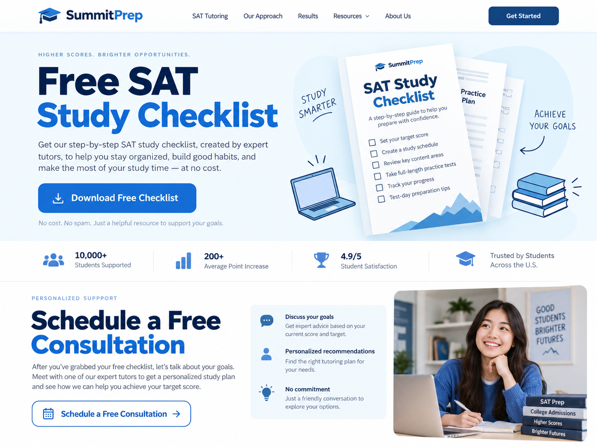

# Reciprocity

## What It Is

Reciprocity is Robert Cialdini's principle that people often feel motivated to return a favor after receiving something useful or valuable first.

In branding and website design, reciprocity can be used by giving visitors something helpful before asking them to take an action.

## When to Use It

Reciprocity works well when a website wants to build trust before asking a visitor to:

- subscribe to an email list
- create an account
- request a consultation
- make a purchase
- download additional content

The value offered should be genuinely useful instead of being misleading or manipulative.

## How to Apply It

A website can use reciprocity by offering something valuable for free, such as:

- a downloadable guide
- a template
- a free trial
- a useful checklist
- an educational article
- a free tool or calculator

The website can then invite the visitor to take another action after receiving that value.

For example, a cooking website could provide a free weekly meal-planning worksheet. After the visitor downloads it, the website could invite them to subscribe to a recipe newsletter.

## Website Design Example

Imagine a tutoring website.

At the top of the page, it offers:

**Free SAT Study Checklist**

Visitors can download the checklist without purchasing anything.

After the download, the website could display:

**Want more help preparing? Schedule a free consultation with one of our tutors.**

The website provides something useful first and then makes a request. This demonstrates reciprocity.

## Visual Example

*AI-generated website mockup showing reciprocity by offering a free SAT study checklist before asking visitors to schedule a consultation.*

## Ethical Use

Reciprocity should not be used to make people feel guilty or pressured.

A good use of reciprocity:

- provides real value
- clearly explains what the user receives
- does not hide important conditions
- allows the user to decline the next request

The goal should be to create a positive relationship with the user rather than forcing them to respond.

## Sources

- Robert Cialdini, Influence at Work: [Seven Principles of Persuasion](https://www.influenceatwork.com/7-principles-of-persuasion/)
- Cialdini, R. B. *Influence: The Psychology of Persuasion.*

## Navigation

[← Back to Principles of Persuasion](../Methods%20of%20Persuasion.md)