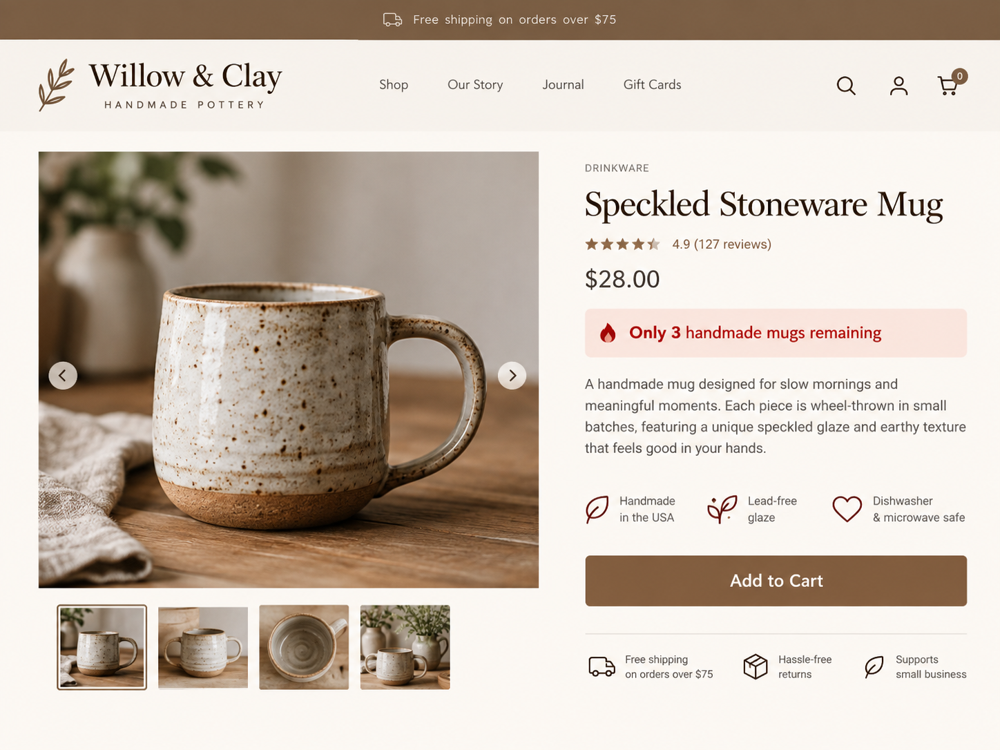

# Scarcity

## What It Is

Scarcity is Robert Cialdini's principle that people often place more value on something when its availability is limited.

In branding and website design, scarcity can encourage people to pay attention to opportunities that may not remain available forever.

## When to Use It

Scarcity can be useful when a website honestly needs to communicate that something is limited, such as:

- a limited number of products
- registration deadlines
- limited event seating
- temporary offers
- limited appointment availability

Scarcity should only be used when the limitation is real.

## How to Apply It

A website can apply scarcity by clearly showing information such as:

- how many products remain
- when registration closes
- how many seats are available
- when an offer ends
- limited appointment times

The information should be accurate and easy for the visitor to understand.

## Website Design Example

Imagine an online pottery store selling handmade mugs.

A product page could display:

**Only 3 handmade mugs remaining**

The message tells customers that the product has limited availability. A customer who already wants the mug may decide to purchase sooner because they understand that it could sell out.

This is an example of scarcity because the limited quantity increases the importance of making a decision before the product becomes unavailable.

## Visual Example

## Ethical Use

Scarcity should not be created artificially just to pressure users.

A responsible use of scarcity:

- uses real availability information
- clearly explains the limitation
- avoids fake countdown timers
- avoids pretending an unlimited product is almost sold out
- gives users enough information to make their own decision

Scarcity should communicate a real limitation rather than manipulate customers with false urgency.

## Sources

- [Robert Cialdini's Seven Principles of Persuasion — Influence at Work](https://www.influenceatwork.com/7-principles-of-persuasion/)

## Navigation

[← Back to Principles of Persuasion](../Methods%20of%20Persuasion.md)