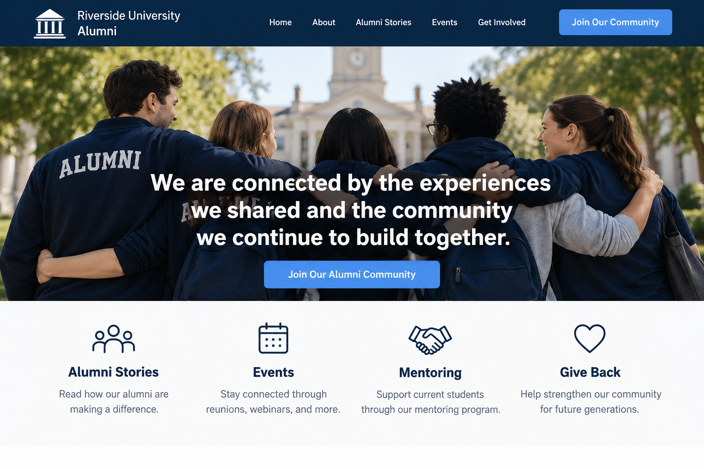

# Unity

## What It Is

Unity is Robert Cialdini's principle that people are more likely to be influenced by others when they feel a shared identity or sense of belonging with them.

In branding and website design, Unity can be used by highlighting shared communities, experiences, values, or identities.

## When to Use It

Unity can be useful when a website is trying to build a strong sense of community.

It works well for:

- universities and alumni groups
- clubs and associations
- nonprofit organizations
- community organizations
- membership groups
- sports teams
- professional networks

The shared identity should be genuine and relevant to the audience.

## How to Apply It

A website can use Unity by highlighting:

- shared experiences
- common values
- community traditions
- member stories
- group achievements
- shared goals
- language such as “we,” “our,” and “together”

The goal is to help visitors feel that they are part of something meaningful.

## Website Design Example

Imagine a university alumni website.

The homepage highlights campus traditions, alumni success stories, and photographs from events.

It also includes a message such as:

**We are connected by the experiences we shared and the community we continue to build together.**

Below that message, the website invites alumni to join a mentoring program for current students.

This demonstrates Unity because the website uses a shared identity and shared experiences to strengthen the connection between alumni and the university community.

## Visual Example

## Ethical Use

Unity should not be used to exclude or manipulate people.

A responsible use of Unity:

- represents the community honestly
- avoids creating unnecessary division
- respects different experiences within the group
- does not pressure people to participate
- uses shared identity in a positive and inclusive way

The goal should be to strengthen genuine community connections.

## Sources

- [Robert Cialdini's Seven Principles of Persuasion — Influence at Work](https://www.influenceatwork.com/7-principles-of-persuasion/)

## Navigation

[← Back to Principles of Persuasion](../Methods%20of%20Persuasion.md)